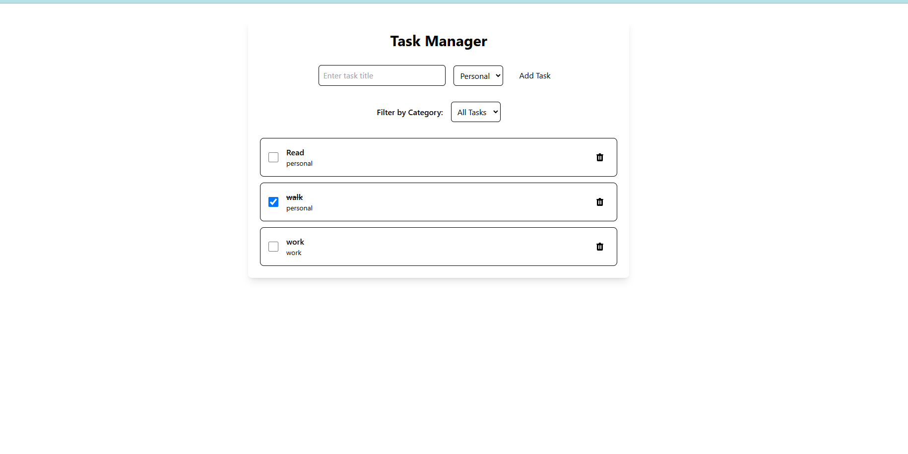

# ToDo App

This is a simple ToDo app built with React and TypeScript. It allows users to add tasks, mark them as completed, categorize tasks, and persist tasks using browser's localStorage.

## Deployment
 https://yegaratech.com/
## Features

- Add tasks with titles and categories
- Mark tasks as completed
- Categorize tasks (e.g., personal, work)
- Persist tasks using browser's localStorage
- Delete tasks
- Responsive design
- Styled using Tailwind CSS

## Installation

1. Clone the repository
2. Install dependencies using `yarn add`
3. Start the development server using `yarn dev`

## Technologies Used

- React
- TypeScript
- Tailwind CSS
- localStorage
- Vite

## Usage

- Add a new task by entering a title and selecting a category
- Mark tasks as completed by checking the checkbox
- Categorize tasks using the dropdown menu
- Delete tasks using the delete button

## Design
 https://www.figma.com/file/sc1avtZ5bo0jyfNUkgHD0N/Todo-list?type=design&node-id=0%3A1&mode=design&t=XRb2T01vQ1c8quvb-1
## Contributing

Contributions are welcome! Feel free to open an issue or submit a pull request.

